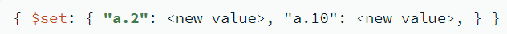

# CRUD operations

## 1. Create: Insert documents

```
db.my_collection.insertOne(document);

db.my_collection.insertMany([document, document, ...]);

document = {field: value, ...}
```

## 2. Read: Find documents

```
// find all documents
db.my_collection.find({});

// find documents that matches the specified conditions
db.my_collection.find(filters);
filters = {
    field_1: {operator_1: value, ...},
    ...
}
```

## 3. Update: Modify documents

```
// update the first document that matches the specified filters
db.my_collection.updateOne(filters, operators);

// update all documents that match the specified filters
db.my_collection.updateMany(filters, operators);

filters = {...}  // apply update on data matching filters
operators = {
  update_operator: { field1: value1, ... },
  update_operator: { field2: value2, ... },
  ...
}  // update to apply
```

### Update operators

#### Behavior



#### Operators for Fields


#### Operators for Arrays

* Operators


* Modifiers


#### Bitwise

