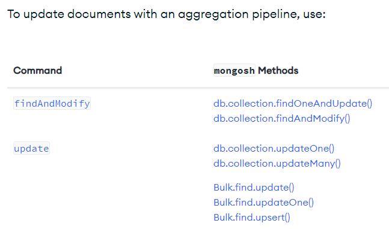
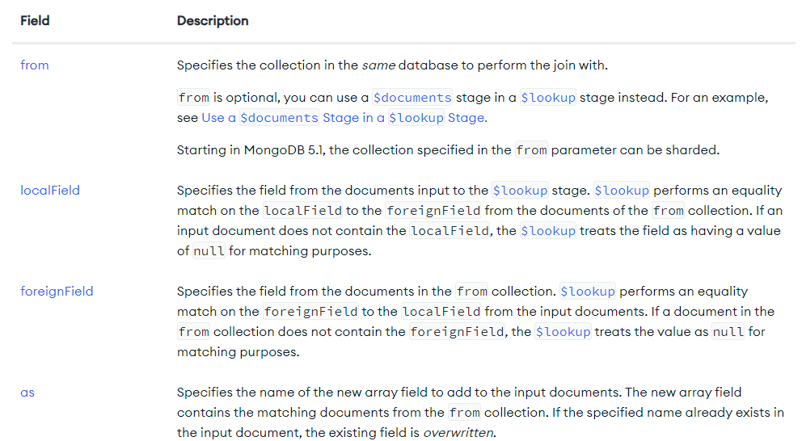
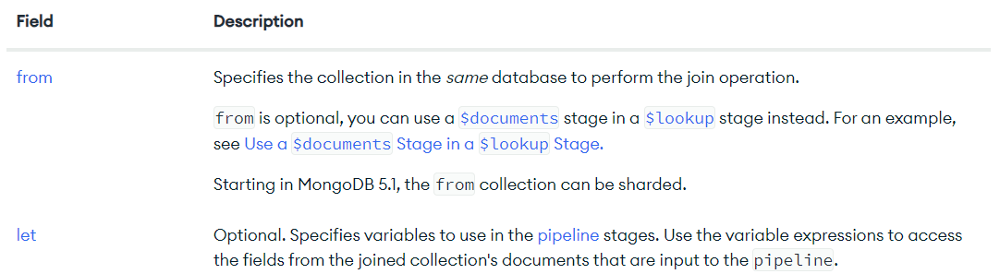
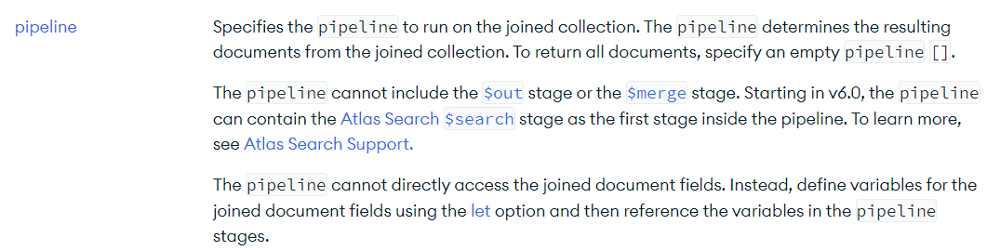
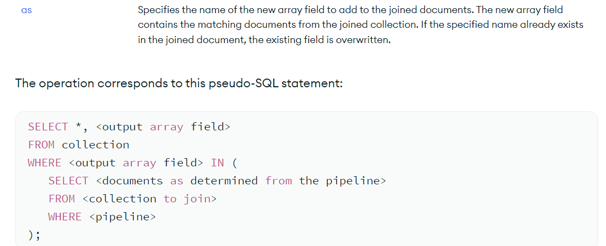

# CRUD operations

## 1. Create: Insert documents

```
db.my_collection.insertOne(document);

db.my_collection.insertMany([document, document, ...]);

document = {field: value, ...}
```

## 2. Read: Find documents

```
// find all documents
db.my_collection.find({}, projection);

// find documents that matches the specified conditions
db.my_collection.find(filters, projection);
filters = {
    field_1: {operator_1: value, ...},
    ...
}

// allow to specify fields you want to display. It is facultative
projection = {field_1: true, field_2: false, ...}

// projection is equivalent to:
SELECT field_1, ... FROM my_table;
```

## 3. Update: Modify documents

```
// update the first document that matches the specified filters
db.my_collection.updateOne(filters, [operators]);

// update all documents that match the specified filters
db.my_collection.updateMany(filters, [operators]);

filters = {...}  // apply update on data matching filters
operators = {
  update_operator: { field1: value1, ... },
  update_operator: { field2: value2, ... },
  ...
}  // update to apply
```

### Update operators

#### Behavior


#### Operators for Fields


#### Operators for Arrays

* Operators


* Modifiers


#### Bitwise


## If/else statements in MangoDB


# Equivalence between SQL and MongoDB

https://www.mongodb.com/docs/manual/reference/sql-comparison/


# Aggregation operations

Aggregation operations process multiple documents and return computed results. You can use aggregation operations to:

* Group values from multiple documents together.

* Perform operations on the grouped data to return a single result.

* Analyze data changes over time.

To perform aggregation operations, you can use:

* Aggregation pipelines, which are the preferred method for performing aggregations.

* Single purpose aggregation methods, which are simple but lack the capabilities of an aggregation pipeline.


## 1. Aggregation pipeline

An aggregation pipeline consists of one or more stages that process documents:

* Each stage performs an operation on the input documents. For example, a stage can filter documents, group documents, and calculate values.

* The documents that are output from a stage are passed to the next stage.

* An aggregation pipeline can return results for groups of documents. For example, return the total, average, maximum, and minimum values.

**IMPORTANT NOTE:**
Starting in MongoDB 4.2, you can update documents with an aggregation pipeline if you use the stages shown in Updates with Aggregation Pipeline.

```
db.orders.aggregate( [
   // Stage 1: get documents where by pizza size is medium
   {
      $match: { size: "medium" }
   },
   // Stage 2: Group remaining documents by pizza name and calculate total quantity
   {
      $group: { _id: "$name", totalQuantity: { $sum: "$quantity" } }
   }
] )
```

### 1.1. Aggregation stages

https://www.mongodb.com/docs/manual/reference/operator/aggregation-pipeline/#std-label-aggregation-pipeline-operator-reference

### 1.2. Aggregation expressions (or operators)

Some aggregation pipeline stages accept an aggregation expression, which:

* Specifies the transformation to apply to the current stage's input documents.

* Transform the documents in memory.

* Can specify aggregation expression operators to calculate values.

* Can contain additional nested aggregation expressions.

https://www.mongodb.com/docs/manual/reference/operator/aggregation/#std-label-aggregation-expressions


**IMPORTANT:**
Aggregation expressions use field path to access fields in the input documents. To specify a field path, prefix the field name or the dotted field name (if the field is in the embedded document) with a dollar sign $. For example, "$user" to specify the field path for the user field or "$user.name" to specify the field path to "user.name" field.

"$<field>" is equivalent to "$$CURRENT.<field>" where the CURRENT is a system variable that defaults to the root of the current object, unless stated otherwise in specific stages.

### 1.3. Update Documents Using an Aggregation Pipeline



### 1.4. Aggregation pipeline limits

https://www.mongodb.com/docs/manual/core/aggregation-pipeline-limits/


### 1.5 Practical MongoDB Aggregations (Book)

https://www.practical-mongodb-aggregations.com/who-this-is-for.html

### 1.6 How to optimize your aggregation pipeline

https://www.mongodb.com/docs/manual/core/aggregation-pipeline-optimization/

## 2. Jointure

### 2.1. $lookup stage (left (outer) join)


#### 2.1.1. Simple left join
```
{
   $lookup:
     {
       from: <collection to join>,
       localField: <field from the input documents>,
       foreignField: <field from the documents of the "from" collection>,
       as: <output array field>
     }
}
```




#### 2.1.2. More complex one

To perform correlated and uncorrelated subqueries with two collections, and perform other join conditions besides a single equality match, use this $lookup syntax:

```
{
   $lookup:
      {
         from: <joined collection>,
         let: { <var_1>: <expression>, …, <var_n>: <expression> },
         pipeline: [ <pipeline to run on joined collection> ],
         as: <output array field>
      }
}
```




The following new concise syntax removes the requirement for an equality match on the foreign and local fields inside of an $expr operator:

```
{
   $lookup:
      {
         from: <foreign collection>,
         localField: <field from local collection's documents>,
         foreignField: <field from foreign collection's documents>,
         let: { <var_1>: <expression>, …, <var_n>: <expression> },
         pipeline: [ <pipeline to run> ],
         as: <output array field>
      }
}
```

#### 2.1.3 Use of $expr to compare fields in the SAME documents

https://www.mongodb.com/docs/manual/reference/operator/query/expr/

# 3. Views

https://www.mongodb.com/docs/manual/core/views/create-view/

