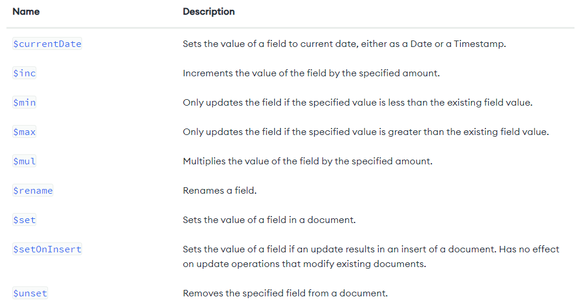
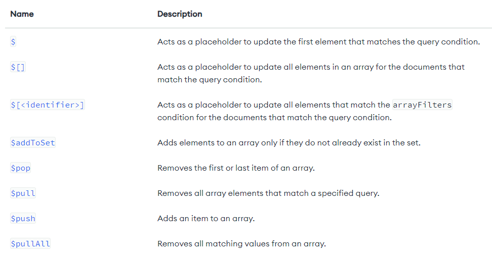
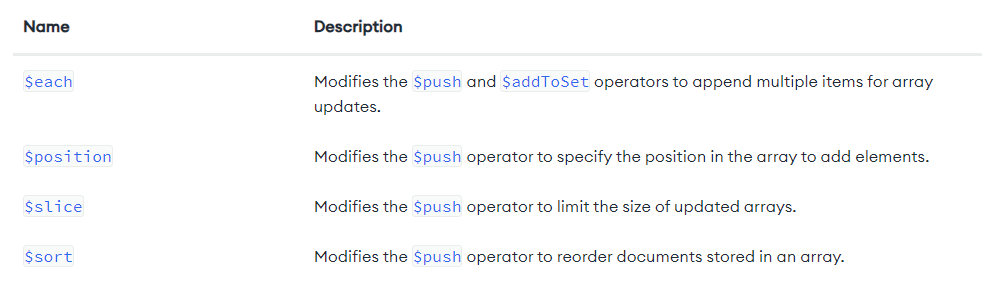
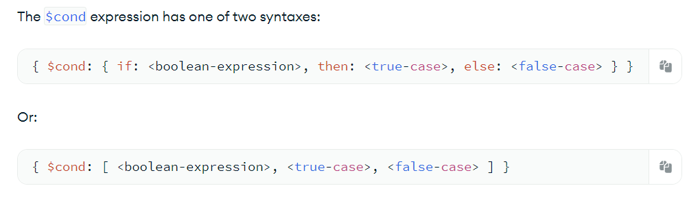

# CRUD operations

## 1. Create: Insert documents

```
db.my_collection.insertOne(document);

db.my_collection.insertMany([document, document, ...]);

document = {field: value, ...}
```

## 2. Read: Find documents

```
// find all documents
db.my_collection.find({}, projection);

// find documents that matches the specified conditions
db.my_collection.find(filters, projection);
filters = {
    field_1: {operator_1: value, ...},
    ...
}

// allow to specify fields you want to display. It is facultative
projection = {field_1: true, field_2: false, ...}

// projection is equivalent to:
SELECT field_1, ... FROM my_table;
```

## 3. Update: Modify documents

```
// update the first document that matches the specified filters
db.my_collection.updateOne(filters, [operators]);

// update all documents that match the specified filters
db.my_collection.updateMany(filters, [operators]);

filters = {...}  // apply update on data matching filters
operators = {
  update_operator: { field1: value1, ... },
  update_operator: { field2: value2, ... },
  ...
}  // update to apply
```

### Update operators

#### Behavior


#### Operators for Fields



#### Operators for Arrays

* Operators


* Modifiers


#### Bitwise


## If/else statements in MangoDB




# Equivalence between SQL and MongoDB

https://www.mongodb.com/docs/manual/reference/sql-comparison/


# Aggregation operations

Aggregation operations process multiple documents and return computed results. You can use aggregation operations to:

* Group values from multiple documents together.

* Perform operations on the grouped data to return a single result.

* Analyze data changes over time.

To perform aggregation operations, you can use:

* Aggregation pipelines, which are the preferred method for performing aggregations.

* Single purpose aggregation methods, which are simple but lack the capabilities of an aggregation pipeline.


## 1. Aggregation pipeline

An aggregation pipeline consists of one or more stages that process documents:

* Each stage performs an operation on the input documents. For example, a stage can filter documents, group documents, and calculate values.

* The documents that are output from a stage are passed to the next stage.

* An aggregation pipeline can return results for groups of documents. For example, return the total, average, maximum, and minimum values.

**IMPORTANT NOTE:**
Starting in MongoDB 4.2, you can update documents with an aggregation pipeline if you use the stages shown in Updates with Aggregation Pipeline.

```
db.orders.aggregate( [
   // Stage 1: get documents where by pizza size is medium
   {
      $match: { size: "medium" }
   },
   // Stage 2: Group remaining documents by pizza name and calculate total quantity
   {
      $group: { _id: "$name", totalQuantity: { $sum: "$quantity" } }
   }
] )
```
